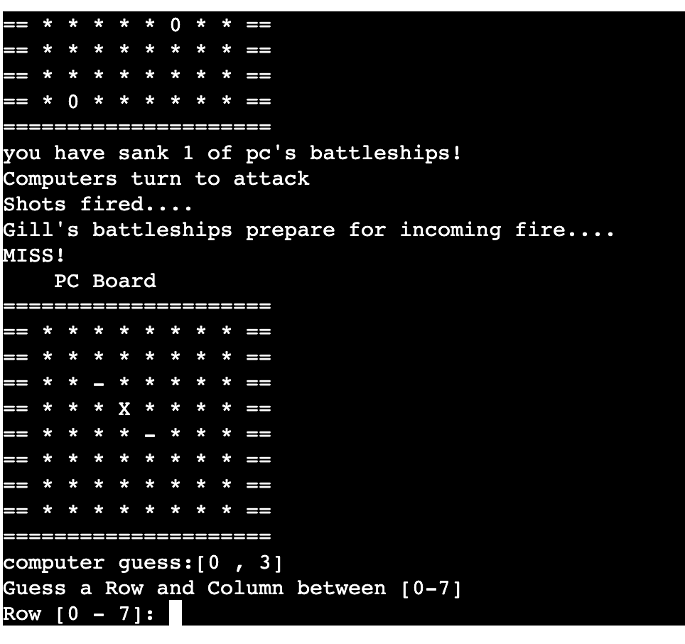

# Battleships

Battleships is a Python terminal game, deployed on Heroku.

Users can try to beat the pc by hitting all the pcs battleships before the pc finds theirs. Each battleship occupies one square on the board. 

# How to play

Battleships is a strategy type guessing game for two players. It is played on a grid where the user and the pc have a (7x7) board. Locations of the ships on the pc board are concealed from the user. All ships are positioned randomly. 

The user can see where its ships are placed indicated by an '0' but cannot see where the computers ships are. Guesses are marked with '-' and hits are indicated by 'X'.

The pc and user take turns to try there shot at sinking each others ships. The winner is the player who successfully sinks all of their opponet's battleships first. The user has 15 turns to sink all the pcs battleships. There is a counter to count how many ships have been destroyed and a counter to count down the number of turns. The user gets a reminder when they have just 5 turns left. 

When the game is over the user is asked if they want to play again or quit the game. 

# Flowchart

# Features

## Random board generation:
- Ships are randomly placed on both the player and computer boards
- The player cannot see where the computer's ships are

- user vs the pc
- Accepts user input
- Counts number of hit ships
- Counts number of turns

## Input validation and error-checking:
- You cannot enter coordinates outside the size of the grid
- You must enter integers
- You cannot enter the same guess twice

## Game over
- When the user has ran out of turns or hit all the pcs ships or vice versa - they will get the messsage to play again or quit. 

# Future Features

- Allow user to select the board size and number of ships
- Allow user to position the ships themselves
- Have ships larger than 1x1
- Have levels from easy to hard by giving user less turns

# Data Model

- I decided to use Board class as my model as I thought it would allow me to code efficiently for creating a battleship game. It allowed me to create an instance of a board which could be generated for both the user and pc. 

- The Board class stores the board size, the number of ships, the symbols that represent a hit, miss and a ship and details such as the values and the board type- 'label'.

# Testing

I have manually tested this project by doing the following:

- Passed my project through PEP8 online checker and confirmed there were no issues. 
- Tested my project by giving it invaild inputs: letters when numbers were expected, guesses outside the range of my board, same input twice. 
- Tested it in both my local terminal and the Code Institute Heroku terminal. 
- Fixed uses as described in problems section of the terminal. 
- Tested by a third party, with focus on invalid input. 

# Bugs

## Solved Bugs
- I had my board set to (0-8) coordinates. This caused my game to crash when I guessed (8,8) or (0,0). I forgot zero indexed- I fixed this by adding '- 1' when needed. 
- I set up a while loop to count 15 turns until the game was over. I discovered that when you hit all ships before your number of turns was up the game would continue. I fixed this by adding a hit counter to count the number of hit ships. If all ships are hit it changes the number of turns to 0 and gives a 'user win' message to the user.
- I managed to hide the ships on pc board up until the user took a guess. When the user took a guess it regenerated the board with hit or miss and exposed the ships on the pc board. In hindsight my design of 'opponets board' may have not been a good idea as it is hard to isolate and update the boards separately. I fixed this bug by adding and if statement to attack_board and using 'self.label' to check which board was which - meaning if it was pc board ships would remain hidden. 
- I noticed that when the game was over and the player asked to play again the boards would regenerate but the values did not update so the score and guesses remained the same. I found this bug the day of submission and so did not have enough time to fix this bug. Instead I decided not to regenerate the board but put in a print statement instead for the user to press 'RUN PROGRAM' at the top of the page if they wanted to play again. 

## Remaining Bugs
- No bugs remaining

# Validator Testing

- PEP8online.com:
No errors were returned.

- I cleared all errors in PEP8. There were a lot of line errors and whitespace errors. For furture reference I would run my game through PEP8 continously throughout the coding process to clear errors early-on. 
- I fixed most problems in the terminal - problems section - the problems that remains are 'missing module docstring' for a couple of my functions and methods. I have a python comment put in place to describe my functions/methods - I did not need a docstring as the explanation was short. 

# Deployment 

This project was deployed using Code Institute's mock terminal for Heroku. Due to a security breach I was not able to deploy via the dashboard - I deployed fully through the terminal in my workspace. Steps are below.  

## Steps:
- I ran the command heroku login -i to prompt login in the terminal of my workspace. 
- I then ran the command heroku create bship4 to create a new app called 'bship4.'
- This created a new Heroku app and linked it to my Gitpod terminal. 
- I was then able to access my app via the Heroku dashboard and set up my config vars and building packs. 
- I set the buildpacks to Python and NodeJS in that order.
- I added the config vars - key - PORT , value - 8000 - as instructed. 
- I ran the command git push heroku main to update my app as I continued to work on it in my workspcae. 

# Credits
- Code Institue for the deloyment terminal.
- My Mentor for his much valued time and help with understanding Python. 
- Code Insitute Tutor Support for help and guidance with my project. 
- Slackover flow
